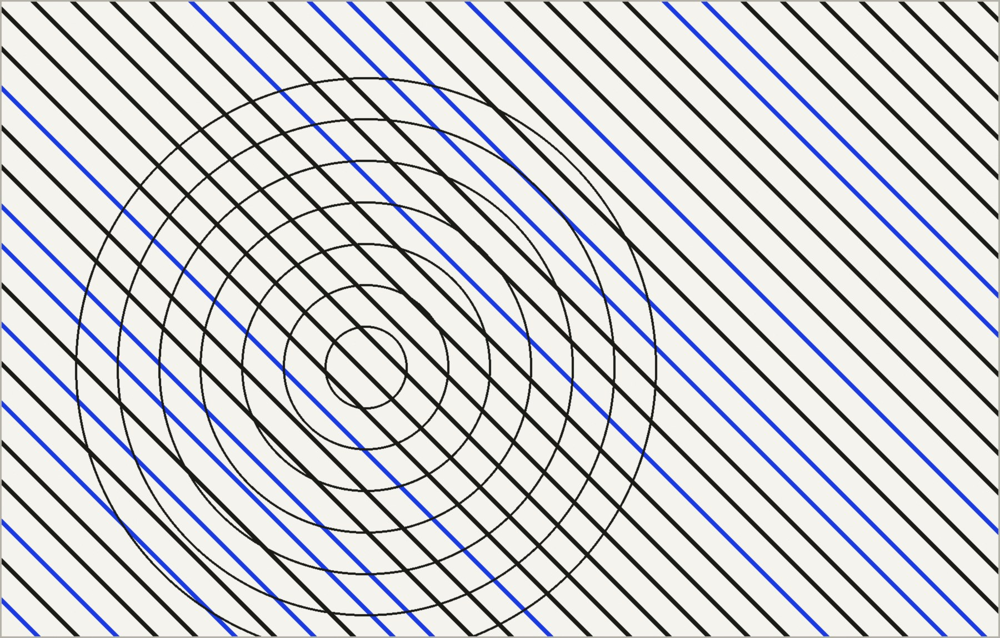

# カスタマイズガイド(v3・複数ページ構成)

前回までの1ページ構成から、実際にページ遷移する複数ページ構成に作り直しました。
ナビゲーションをクリックすると、スクロールではなく本当に別のHTMLファイルが開きます。

```
portfolio/
├── index.html      ← Home(キービジュアルのみ)
├── work.html       ← Work(Instagram風グリッド)
├── about.html      ← About(文字のみ)
├── contact.html    ← Contact(リンク一覧)
│                     ※ Shop は専用ページを作らず、ナビから直接
│                        外部サイトへ飛ぶようにしています(後述)
├── partials/
│   ├── header.html   ← ★ 全ページ共通のヘッダー・ナビ(ここを直せば全ページに反映)
│   └── footer.html   ← ★ 全ページ共通のフッター
├── css/
│   ├── variables.css   ← 色・フォント・サイズの設定パネル
│   ├── base.css         ← 全ページ共通(ヘッダー・ナビ・フッターの見た目)
│   ├── page-home.css    ← Home専用
│   ├── page-work.css    ← Work専用(グリッド・ポップアップ)
│   ├── page-about.css   ← About専用
│   └── page-contact.css ← Contact専用
├── js/
│   ├── works-data.js  ← 作品データ(Workページの内容はここだけで管理)
│   └── main.js         ← 共有パーツの読み込み・ナビの開閉・グリッド生成・ポップアップ
└── images/             ← サンプル画像(hero.jpg / work-01〜06.jpg)を仮置き済み
```

画像はすべて、後で差し替えやすいようにダミーの抽象画像を自動生成して
仮置きしてあります。同じファイル名で上書きするだけで差し替わります。

---

## 1. 見た目の基本(色・フォント・サイズ)を変える

**`css/variables.css`** を開いてください。

```css
--color-accent: #1B3AE0;   /* リンクなどの差し色 */
--font-mono: 'Courier Prime', 'Courier New', ... ; /* フォント */
--text-base: 0.85rem;       /* 本文の基準サイズ。数値を上げると全体が大きくなります */
```

サイト全体の文字はここの `--text-*` を基準に決まっているので、
「もう少し小さく/大きくしたい」はこのファイルの数値調整だけで反映されます。

---

## 2. ヘッダー・ナビゲーションを変える(共有パーツ化 済み)

★ **アップデート**: ヘッダーとフッターは、以前は5つのHTMLファイルに
同じ内容をコピーする必要がありましたが、今は **`partials/header.html`
と `partials/footer.html` を1回編集するだけで、全ページに自動で反映される**
仕組みにしました。各HTMLファイルには

```html
<div data-include="partials/header.html"></div>
```

という1行が置いてあるだけで、ページを開いたときに `js/main.js` が
この部分を `partials/header.html` の中身に自動で差し替えます。

```
portfolio/
├── partials/
│   ├── header.html   ← ★ ヘッダー・ナビ・SNSリンクはここを編集
│   └── footer.html   ← ★ フッターはここを編集
```

`partials/header.html` の中身:

```html
<header class="site-header">
  <a href="index.html" class="logo">YAMADA TARO</a>   ← ① サイト名

  <div class="header-right">
    <button class="nav-toggle" ...>menu</button>        ← ② スマホ用メニューボタン
    <ul class="main-nav" data-main-nav>
      <li><a href="index.html" data-nav-key="index.html">home</a></li>   ← ③ ナビ項目
      <li><a href="work.html" data-nav-key="work.html">work</a></li>
      <li><a href="about.html" data-nav-key="about.html">about</a></li>
      <li><a href="contact.html" data-nav-key="contact.html">contact</a></li>
      <li><a href="https://your-shop-url.example.com" target="_blank">shop</a></li>  ← ④ Shopリンク
    </ul>
  </div>

  <nav class="social-mini">                              ← ⑤ 右上の小さなSNSリンク
    <a href="https://instagram.com/">ig</a>
    <a href="https://x.com/">x</a>
  </nav>
</header>
```

- **① サイト名を変える**: `YAMADA TARO` の文字を書き換える(1ファイルだけでOK)
- **② ナビ項目を増減したい**: `<li><a href="...">...</a></li>` を増減する。
  新しいページを足す場合は、対応するHTMLファイルも新しく作る必要があります
- **③ 現在地の表示**: `data-nav-key` の値が、開いているページのファイル名
  (`index.html` など)と一致すると、自動で青い下線が付きます。
  `aria-current` を手で付け外しする必要はもうありません
- **④ Shopのリンク先変更**: `href="https://your-shop-url.example.com"` を
  実際のショップURLに書き換える。**この1ファイルを直すだけで全ページに反映されます**
- **⑤ SNSリンクの変更**: `href` の中身をご自身のアカウントURLに書き換える

**注意点**: この仕組みは `fetch` を使って `partials/header.html` を
読み込んでいるため、`index.html` を**ダブルクリックして直接開くと動きません**。
必ず VS Code の「Live Server」拡張機能や `python3 -m http.server` などの
ローカルサーバー経由で開いてください(GitHub Pages で公開したときは
問題なく動作します)。もし画面に「partials/header.html を読み込めませんでした」
という文字が出たら、サーバー経由で開けているか確認してください。

---

## 3. Home ページ(`index.html`)を変える

```html
<section class="hero-visual">
     ← ① キービジュアル画像

  <div class="hero-news">
    <span><span class="label">news —</span>shopに新しいZineを追加しました。</span>  ← ② お知らせ文
    <a class="hlink" href="https://your-shop-url.example.com">shopを見る →</a>       ← ③ お知らせのリンク先
  </div>
</section>
```

- **① キービジュアルの差し替え**: `images/hero.jpg` を同じファイル名で
  上書きするのが一番簡単です。ファイル名を変える場合は `src=""` の中身も変更
- 画像の表示の高さは `css/page-home.css` の `.hero-visual { height: ... }` で
  調整できます(初期値は画面の高さいっぱい)
- **② お知らせ文言を変える**: そのままテキストを書き換えるだけ
- **③ リンク先を変える**: shopの実際のURLに書き換える

---

## 4. Work ページ(`work.html`)を変える

グリッドの中身は **HTMLを直接触らず**、`js/works-data.js` の配列を
編集するだけで反映されます。

```js
{
  id: "07",
  title: "作品タイトル",
  year: "2026",
  medium: "Illustration",
  image: "images/work-07.jpg",   // images フォルダに画像を追加してパスを指定
  description: "ポップアップに表示する説明文"
},
```

- グリッドの列数を変えたい場合は `css/page-work.css` の
  `.work-grid { grid-template-columns: repeat(4, 1fr); }` の `4` を変更
  (スマホ表示の列数は少し下の `@media` 内で個別に指定しています)
- ポップアップに出す情報を増やしたい場合は、`work.html` 内の
  `<div class="work-modal-body">` の中身と、`js/main.js` の
  `setupWorkModal()` 内の対応行を合わせて編集してください

---

## 5. About ページ(`about.html`)を変える

装飾がほぼ無いページなので、`<main class="wrap about-body">` の中の
`<p>` タグの文章と、`<dl class="about-history">` 内の年表をそのまま
書き換えるだけです。HTMLタグ自体はほぼ触らずに使えます。

---

## 6. Contact ページ(`contact.html`)を変える

`<ul class="contact-list">` の中の各 `<li class="row">` を、
1項目=1行として増減してください。

```html
<li class="row">
  <span class="label">mail</span>
  <a class="hlink" href="mailto:あなたのメールアドレス">あなたのメールアドレス</a>
</li>
```

---

## 7. 動作の仕組みについて(触らなくてOKな部分)

- `js/main.js`: ナビの開閉、Workグリッドの自動生成、ポップアップの
  開閉を担当しています。通常は編集不要です
- 新しいページ(例: Newsページなど)を増やす場合は、既存のHTMLファイル
  (例えば `about.html`)をコピーして中身を書き換え、`<title>` と
  `main` の中身を差し替えたうえで、5ファイルすべての `main-nav` に
  リンクを追加してください

---

## 8. パソコンで確認する方法

```
cd portfolio
python3 -m http.server 8000
```
ブラウザで `http://localhost:8000` を開く。

## 9. GitHub Pages で公開する

既存リポジトリの中身をこのフォルダの中身で置き換えて push してください。

```
git add .
git commit -m "サイトを複数ページ構成にリニューアル"
git push
```
